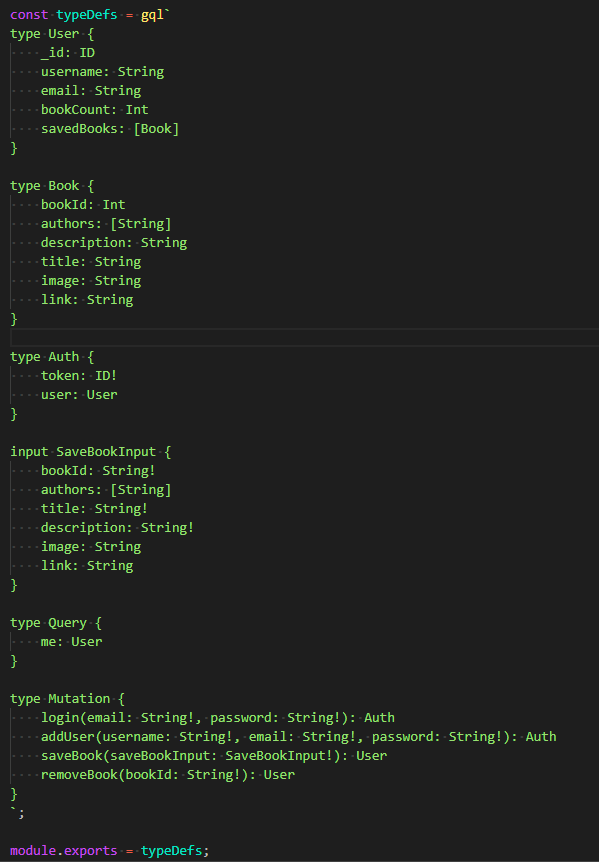

# Book Search Engine

Despite completing all the tasks in the assignment instructions, I have been unable to refactor the book search engine using GraphQL. My React app is loading with a white screen, which, in my experience, means there is something wrong on the backend. I will revisit the assignment in the future to try to pinpoint the problem. I have included screenshots of the backend typeDefs and resolvers,the frontend queries and mutations, and the frontend SearchBooks.js and SavedBooks.js as I suspect my error(s) is somewhere in one of those places.

### TypeDefs:

### Resolvers:

### Queries:

### Mutations

### SearchBooks.js:

### SavedBooks.js:
